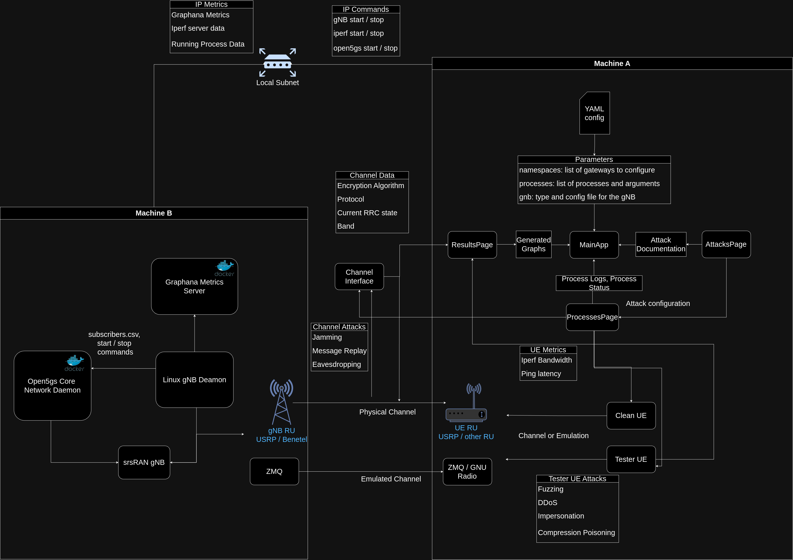

.. Soft-Tester UE documentation master file, created by
   sphinx-quickstart on Thu Sep 12 16:04:18 2024.
   You can adapt this file completely to your liking, but it should at least
   contain the root `toctree` directive.

NTIA Software Tester UE
==========================

Penetration testing tool for Software Defined Radio

Overview
--------

This project is a security testing tool based on srsRAN Project's User Equipment, used to test 5G and open radio access networks (RANs) via the Uu air interface between the UE and the network. While this enables different types of testing, the focus of the software is on RAN security testing. This soft T-UE is fully software-defined and compatible with widely available, commercial off-the-shelf software radio hardware. Standardized 3GPP or O-RAN tests as well as custom test procedures can then be implemented and executed at minimal cost and at different stages of RAN development and integration. This system allows for testing many commercial and open source random access networks with minimal technical overhead. Many attacks on the RAN can be run automatically by the system.

- :doc:`UE Documentation <rstFiles/UE>`
- :doc:`gNB Documentation <rstFiles/gNB>`

**NOTE: This system is designed to run on Ubuntu and is tested on Ubuntu 20.04.**

Installation
------------
If testing with ZMQ one machine can be used. If using an RU run with two machines A and B.

To install the UE run (Machine A):

.. code-block:: bash

   sudo ./scripts/install-ue.sh

To install the gNB run (Machine B):

.. code-block:: bash

   sudo ./scripts/install-open5gs.sh
   sudo ./scripts/install-gnb.sh

Running
-------

To start the gNB daemon (Machine B):

.. code-block:: bash

   sudo systemctl daemon-reload
   sudo systemctl start gnb-controller.service

To run the GUI (Machine A):

.. code-block:: bash

   cd controller/ue
   python3 main.py

System Architecture
--------------------

.. toctree::
   :maxdepth: 1
   :caption: General

   UE Documentation <rstFiles/UE>
   gNB Documentation <rstFiles/gNB>
   Installation guide <rstFiles/installation>
   Message Types <rstFiles/messageTypes>
   IP Routing <rstFiles/ipRouting>
   Multi-UE Emulation <rstFiles/multiUE>
   
.. toctree::
   :maxdepth: 1
   :caption: Attacks implemented

   attacks/cqi_manipulation.rst
   attacks/gnb_impersonation_attack.rst
   attacks/imsi_capture.rst
   attacks/preamble_collision.rst
   attacks/rach_jamming.rst
   attacks/rach_replay.rst
   attacks/rach_signal_flooding.rst
   RoHC Poisoning Attack <attacks/rohc_poisoning_attack>
   attacks/signal_storming.rst
   attacks/pdcpParrot.rst
   RRC Release Request Spoofing <attacks/request_spoofing>
   attacks/sdu_fuzzing.rst
