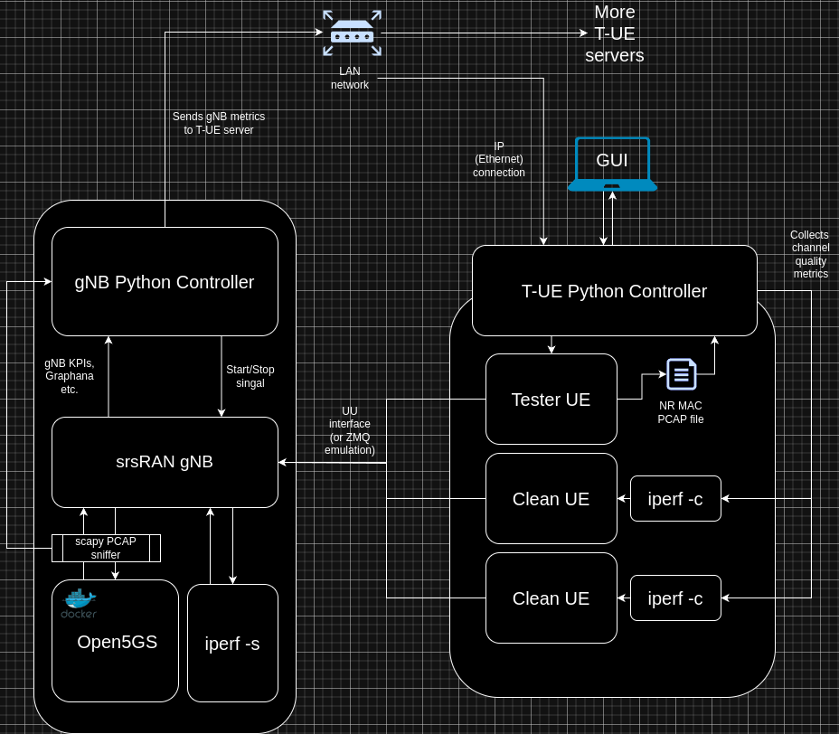

.. Soft-Tester UE documentation master file, created by
   sphinx-quickstart on Thu Sep 12 16:04:18 2024.
   You can adapt this file completely to your liking, but it should at least
   contain the root `toctree` directive.

NTIA Software Tester
=====================

An SDR security testing UE based on srsRAN's UE.

Overview
--------

The tester consists of a client PC running the test GUI and a server PC running
the base station. (In some cases, a single PC can run both the client and the
server.) The client GUI launches a series of applications to run a test. It
communicates with the server to indirectly launch server-side applications with
appropriate configurations.

Legend:

- A solid line indicates a process/subprocess relationship. If bidirectional,
  the subprocess provides data back to the process via pipes.
- A dotted line indicates data movement between two processes.

Installation
------------

To install the UE, run:

.. code-block:: bash

   ./scripts/install-ue.sh

To install the gNB, run:

.. code-block:: bash

   ./scripts/install-open5gs.sh
   ./scripts/install-gnb.sh

To install dependencies for the UE controller, use:

.. code-block:: bash

   cd ue-controller
   poetry install

Running
-------

To run the controller, use:

.. code-block:: bash

   cd ue-controller
   poetry run python ue_controller/ui.py

.. toctree::
   :maxdepth: 1
   :caption: Attacks implemented

   attacks/cqi_manipulation.rst
   attacks/gnb_impersonation_attack.rst
   attacks/imsi_capture.rst
   attacks/preamble_collision.rst
   attacks/rach_jamming.rst
   attacks/rach_replay.rst
   attacks/rach_signal_flooding.rst
   attacks/rohc_poisoning_attack.rst
